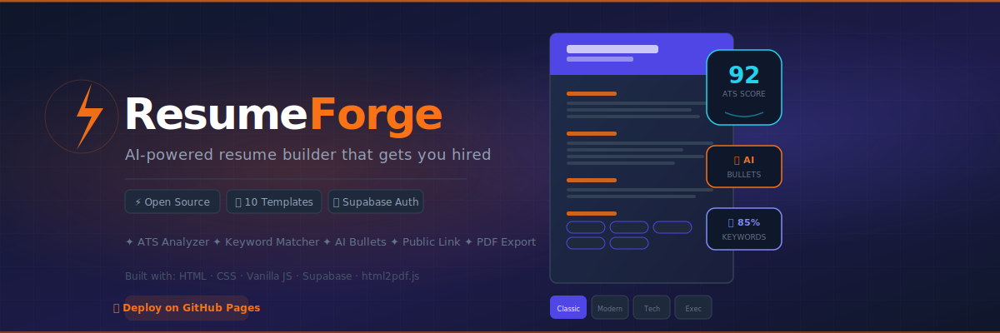

<div align="center">
  
  <br/><br/>

  
  
  
  
  
</div>

---

# ⚡ ResumeForge

> **AI-powered resume builder** — 10 professional templates, real-time ATS scoring, job description keyword matching, AI bullet generator, and one-click public resume hosting. Deployable on GitHub Pages with Supabase as the backend.

---

## ✨ Features

| Feature | Description |
|---|---|
| **10 Professional Templates** | Classic ATS, Modern Bold, Corporate Blue, Creative Sidebar, Swiss Minimal, Executive, Tech Developer, Timeline, Two-Column Pro, Compact One-Page |
| **Live Preview** | A4 resume updates in real-time as you type, with zoom slider (40–100%) |
| **ATS Analyzer** | 0–100 score with specific improvement suggestions |
| **Keyword Matcher** | Paste any job description — instantly see matched/missing keywords |
| **✨ AI Bullet Generator** | Role-aware bullet generation — specify job + task, get 3–5 polished bullets |
| **PDF Export** | High-quality A4 PDF via html2pdf.js |
| **Plain Text Export** | ATS-safe `.txt` version for legacy applicant systems |
| **🌐 Public Resume Link** | One-click publish with a shareable `?slug=` URL |
| **Template Customization** | 12 accent color presets + color picker + 8 fonts + size slider |
| **Auto-save** | Syncs to Supabase every 1.5 seconds automatically |
| **Authentication** | Email/password sign up, sign in, forgot password via Supabase |

---

## 🚀 Quick Start (5 minutes)

### 1. Set up the database

1. Create a free project at [supabase.com](https://supabase.com)
2. Go to **SQL Editor → New Query**
3. Paste the contents of `supabase-setup.sql` and click **Run**
4. Confirm **Authentication → Providers → Email** is enabled

### 2. Add your credentials

Edit `js/config.js`:

```js
const SUPABASE_URL = 'https://your-project.supabase.co';
const SUPABASE_KEY = 'your-anon-public-key';
```

### 3. Deploy

```bash
# GitHub Pages
git clone https://github.com/yourusername/resume-builder
# Push to GitHub → Settings → Pages → main branch / root → Save

# Local development
npx serve .
# or
python3 -m http.server 8080
```

---

## 📁 Project Structure

```
resume-builder/
├── index.html              # Login / Sign up / Forgot password
├── dashboard.html          # Resume management dashboard
├── builder.html            # Main resume editor (3-panel layout)
├── resume.html             # Public shareable resume viewer
├── supabase-setup.sql      # ← Run this first in Supabase SQL Editor
│
├── css/
│   ├── main.css            # Global styles, auth page, dashboard layout
│   ├── builder.css         # Builder layout, form cards, zoom slider
│   ├── templates.css       # All 10 resume template styles
│   └── dashboard-extra.css # Sidebar icons, modal overlays, action cards
│
├── js/
│   ├── config.js           # Supabase client initialization
│   ├── auth.js             # Login / signup / password reset
│   ├── dashboard.js        # Resume grid, CRUD, publish/unpublish
│   ├── builder.js          # Builder logic, form ↔ state ↔ preview
│   ├── templates.js        # All 10 resume renderers (pure JS)
│   ├── ats-checker.js      # ATS scoring algorithm
│   ├── keyword-checker.js  # Job description keyword matcher
│   ├── ai-generator.js     # Mock AI bullet point generator
│   └── export.js           # PDF, print, plain text export
│
└── assets/
    ├── icons.svg           # SVG icon sprite (30+ icons)
    └── banner.svg          # GitHub repo banner
```

---

## 🎨 The 10 Templates

| # | Template | Best For |
|---|---|---|
| 1 | **Classic ATS** | Maximum ATS compatibility, traditional roles |
| 2 | **Modern Bold** | Tech, product, startup roles |
| 3 | **Corporate Blue** | Finance, consulting, enterprise |
| 4 | **Creative Sidebar** | Design, marketing, creative fields |
| 5 | **Swiss Minimal** | Academic, research, clean aesthetic |
| 6 | **Executive** | Senior, director, C-suite roles |
| 7 | **Tech Developer** | Software engineers, DevOps, data |
| 8 | **Timeline** | Recent grads, career changers |
| 9 | **Two-Column Pro** | General professional use |
| 10 | **Compact One-Page** | Experienced professionals with lots to say |

---

## 🗄 Database Schema

### `resumes` table

| Column | Type | Notes |
|---|---|---|
| `id` | `uuid` | Auto-generated PK |
| `user_id` | `uuid` | FK → `auth.users` |
| `title` | `text` | Display name |
| `data_json` | `jsonb` | All resume content |
| `template` | `text` | Template key |
| `is_public` | `boolean` | Published status |
| `public_slug` | `text` | Shareable URL slug |
| `created_at` | `timestamptz` | Creation time |
| `updated_at` | `timestamptz` | Auto-updated on save |

---

## 🛡 Security

- Row Level Security (RLS) enabled — users only access their own data
- Public resumes: SELECT-only, filtered by `is_public = true`
- Supabase anon key is safe to expose (publishable by design)

---

## 🧩 Dependencies (CDN, no npm needed)

| Library | Purpose |
|---|---|
| `@supabase/supabase-js@2` | Auth + database |
| `html2pdf.js@0.10.1` | PDF export |

No build step. No bundler. No framework. Pure HTML + CSS + JS.

---

## 🤝 Contributing

1. Fork → feature branch → PR
2. Ideas: new templates, real AI integration (Anthropic API), i18n, cover letter builder

---

## 📄 License

MIT — free to use, modify, and distribute.

---

<div align="center">
  <strong>Built with ⚡ — zero dependencies, maximum features.</strong>
</div>
